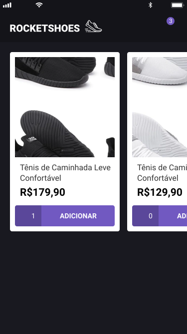
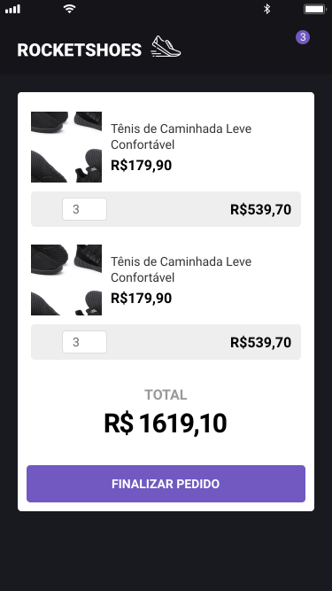

<h1 align="center" id="top">
    
</h1>

<h3 align="center">
  Código do desafio do 7° e 8° módulo do   Bootcamp - GoStack
</h3>

<blockquote align="center">“Não espere resultados brilhantes se suas metas não forem claras”!</blockquote>

 

<h1 align="center">Rocketshoes</h1>

  

  

  

  

  <a href="#dart-sobre">Sobre</a> &#xa0; | &#xa0;
  <a href="#rocket-tecnologias">Tecnologias</a> &#xa0; | &#xa0;
  <a href="#memo-licença">Licença</a> &#xa0; | &#xa0;
  <a href="https://github.com/maurodesouza" target="_blank">Autor</a>

 

## :dart: Sobre ##

O desafio do 7° módulo foi criar uma interface para mobile, de um ecommerce onde fosse possível adicionar produtos ao carrinho, e o desafio do 8° módulo era converter toda aplicação para react hooks.

 

  
  

 

## :rocket: Tecnologias ##

As seguintes tecnologias foram usadas nesse projeto

- [React Native](https://reactnative.dev/)
- [React Navigation](https://reactnavigation.org/)
- [Styled Components](https://styled-components.com/)
- [Redux](https://redux.js.org/)
- [Redux Saga](https://redux-saga.js.org/)
- [Reactotron](https://infinite.red/reactotron)
- [Eslint](https://eslint.org/)

## :memo: Licença ##

Este projeto esta sob licença MIT. Para mais detalhes, veja o arquivo [LICENSE](LICENSE.md).

Feito com :heart: por <a href="https://github.com/maurodesouza" target="_blank">Mauro de Souza</a>

&#xa0;

<a href="#top">Voltar para o top</a>
